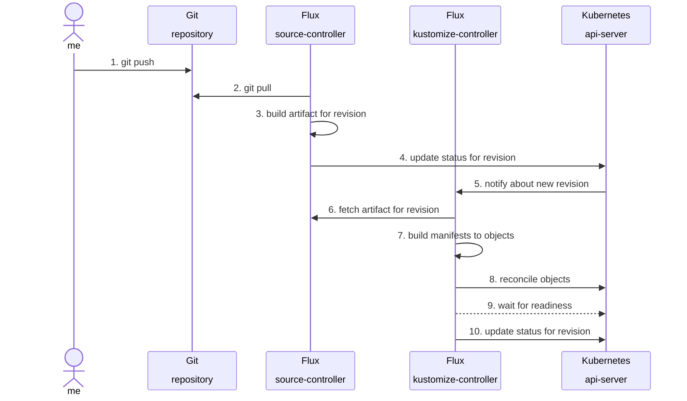

# keos-apps

> [!NOTE]
> This repository is based on the `d1` reference architecture for the
> [ControlPlane Enterprise for Flux CD](https://github.com/controlplaneio-fluxcd/distribution/blob/main/guides/ControlPlane_Flux_D1_Reference_Architecture_Guide.pdf).

## Scope and Access Control

This repository is managed by the Platform team who are responsible for the Kubernetes use case applications.

This repository is used to define the application components such as:

- Flux HelmRepositories (pointing to the application Helm charts in container registries)
- Flux HelmReleases for the applications with custom configuration per size
- Custom resrouces such as Pgcluster, Oscluster...

The platform team is also responsible for setting up any cluster-wide resources that the applications depend on, such as CRD controllers, Ingress classes, Storage classes, etc. The cluster components managed by the platform team are defined in the [keos-system-services repository](https://github.com/Stratio/keos-system-services).

This repository is reconciled on the cluster fleet by Flux as the **cluster admin**. Access to this repository is restricted to the Platform team and the [Flux bot account](https://github.com/forselli-stratio/keos-fleet-test?tab=readme-ov-file#github-account-for-flux).

## Repository Structure

This repository contains the following directories:

- The **components** dir contains Flux HelmReleases and custom resources that define how the applications are deployed to the cluster fleet and which configuration should be used for each size.

```sh
./components/
└── discovery
    ├── base
    │   ├── kustomization.yaml
    │   └── base-values.yaml
    ├── production
    │   ├── kustomization.yaml
    │   ├── production-values.yaml
    └── staging
        ├── kustomization.yaml
        ├── staging-values.yaml
```

## Continuous Delivery

Changes to the `main` branch are automatically reconciled by Flux on the staging cluster.



After the changes are reconciled on staging, the platform team can promote the changes to the production clusters by merging the `main` branch into the `production` branch.
